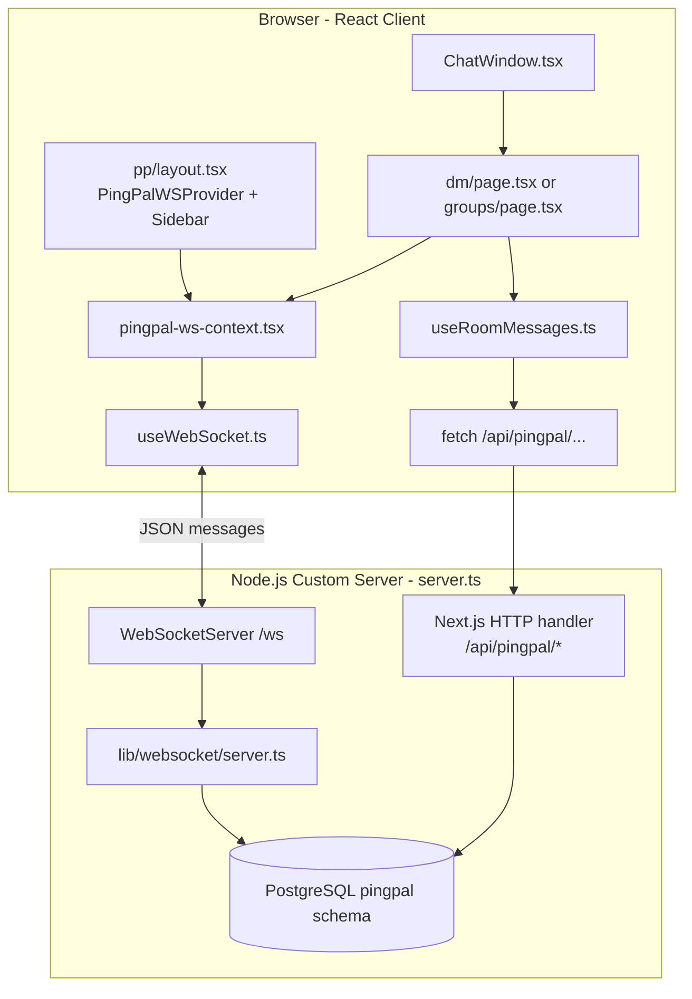

# PingPal Messaging Architecture — Deep Dive

PingPal uses a **hybrid architecture**: **REST (HTTP)** for loading history and CRUD, and **WebSockets** for real-time events (new messages, typing, reactions). PostgreSQL is the source of truth; the WebSocket server is an in-memory **pub/sub router** between connected clients.

---

## 1. High-Level Architecture



**Key idea:** One persistent WebSocket per logged-in user. All real-time events flow through it. Historical data is fetched over normal HTTP APIs.

---

## 2. Server Boot — How WebSocket Gets Attached

PingPal does **not** use Next.js API routes for WebSockets. It runs a **custom HTTP server** that mounts both Next.js and a WebSocket server.

**File:** `server.ts`

```typescript
app.prepare().then(async () => {
  const { initWebSocketServer } = await import("@/lib/websocket/server");

  const server = createServer((req, res) => {
    const parsedUrl = parse(req.url ?? "", true);
    handle(req, res, parsedUrl);
  });

  const wss = new WebSocketServer({ noServer: true });
  initWebSocketServer(wss);

  server.on("upgrade", (req, socket, head) => {
    const { pathname } = parse(req.url ?? "");
    if (pathname === "/ws") {
      wss.handleUpgrade(req, socket, head, (ws) => {
        wss.emit("connection", ws, req);
      });
    }
  });
});
```

**What happens:**
1. Browser fetches a short-lived JWT from `GET /api/pingpal/ws-token` (session cookie required).
2. Browser opens `ws://host/ws?token=...` (HTTP **Upgrade** request).
3. Server verifies the JWT and derives `userId` from the token subject — never from client input.
4. All other requests go to Next.js (pages + REST APIs).

This is the standard pattern for adding WebSockets to Next.js.

---

## 3. WebSocket Server — In-Memory Pub/Sub

**File:** `src/lib/websocket/server.ts`

### Two maps power routing

```typescript
// Map of userId → WSClient
const clients = new Map<string, WSClient>();

// Map of roomId → Set of userIds
const roomClients = new Map<string, Set<string>>();
```

| Map | Purpose |
|-----|---------|
| `clients` | One live socket per user (`userId → { ws, rooms }`) |
| `roomClients` | Who should receive events for a room (`roomId → Set<userId>`) |

### On connect

When a client connects:
1. Extract JWT from query string (`?token=...`).
2. Verify signature, expiry, audience (`pingpal-ws`), and issuer — reject with close code `1008` if invalid.
3. Read `userId` from the JWT `sub` claim (server-issued only).
4. Store client in `clients` map.
5. Mark user online in `pingpal.user_presence`.
6. Load all rooms from `pingpal.room_members` and subscribe user in `roomClients`.
7. Listen for incoming JSON messages → `handleMessage(userId, msg)`.
8. On disconnect: remove from maps, mark offline in DB.

**Important:** Only **one socket per userId** is kept. A new connection replaces the old one.

### Broadcasting

```typescript
export function broadcastToRoom(roomId, payload, excludeUserId?) {
  const members = roomClients.get(roomId);
  const data = JSON.stringify(payload);
  members.forEach((userId) => {
    if (userId === excludeUserId) return;
    clients.get(userId)?.ws.send(data);
  });
}
```

Every WS message is JSON: `{ type: "...", ...fields }`. The `type` field is the event name (like an RPC method name).

---

## 4. Client WebSocket Connection

### Layer 1: `useWebSocket.ts` — raw connection

**File:** `src/hooks/useWebSocket.ts`

- Fetches a short-lived token from `GET /api/pingpal/ws-token`
- Opens `new WebSocket(\`${wsUrl}/ws?token=${token}\`)`
- On open: flush queued outbound messages
- On message: parse JSON, call handler
- On close: reconnect after 3s (1s after auth failure to fetch a fresh token)
- `send()`: JSON.stringify and send, or queue if not yet open

Features: auto-reconnect with token refresh, outbound queue, handler ref (no reconnect when handler changes).

### Layer 2: `pingpal-ws-context.tsx` — single shared connection

**File:** `src/components/pingpal/pingpal-ws-context.tsx`

```typescript
export function PingPalWSProvider({ enabled, children }) {
  const subscribersRef = useRef<Set<Handler>>(new Set());

  const dispatch = (msg) => {
    for (const handler of subscribersRef.current) {
      handler(msg);
    }
  };

  const { send } = useWebSocket(enabled, dispatch);

  const subscribe = (handler) => {
    subscribersRef.current.add(handler);
    return () => subscribersRef.current.delete(handler);
  };
}
```

**Why this exists:** Layout (sidebar) and chat pages both need WS events, but there must be **only one connection**. The provider uses a **pub/sub pattern**: one socket, many listeners.

Mounted in `src/app/(secure)/pp/layout.tsx`:

```tsx
<PingPalWSProvider enabled={Boolean(userId)}>
  <PingPalLayoutInner>{children}</PingPalLayoutInner>
</PingPalWSProvider>
```

---

## 5. WebSocket Message Types (Server Protocol)

All handled in `handleMessage()` in `src/lib/websocket/server.ts`:

| Client → Server | Server action | Server → Clients broadcast |
|-----------------|---------------|----------------------------|
| `send_message` | INSERT message in DB, fetch full row | `{ type: "new_message", message }` |
| `typing` | No DB | `{ type: "typing", roomId, userId, isTyping }` (excludes sender) |
| `mark_read` | UPDATE `room_members.last_read_at` | *(none)* |
| `react` | INSERT/DELETE reaction | `{ type: "reaction", messageId, userId, emoji, removed }` |
| `join_room` | Add user to in-memory room set | *(none)* |

### Example: sending a message end-to-end

**Step 1 — User types and hits Enter**

`MessageInput` → `ChatWindow` → `dm/page.tsx`:

```typescript
const handleSend = (content, replyToId) => {
  send({ type: "send_message", roomId, content: content.trim(), replyToId });
};
```

**Step 2 — Client sends JSON over WebSocket:**

```json
{ "type": "send_message", "roomId": "abc", "content": "Hello!", "replyToId": null }
```

**Step 3 — Server validates, persists, broadcasts**

1. Check user is room member.
2. `INSERT INTO pingpal.messages`.
3. Re-fetch full message with joins (`MESSAGE_SELECT` — sender, reply_to, reactions).
4. `broadcastToRoom(roomId, { type: "new_message", message })`.

**Step 4 — All room members receive:**

```json
{ "type": "new_message", "message": { "id": "...", "content": "Hello!", "sender_id": "...", ... } }
```

**Step 5 — Client handlers update UI**

- **Sidebar** (`pp/layout.tsx`): updates last message, unread badge, desktop notification.
- **Active chat** (`useRoomMessages.ts`): appends message to the list.
- **DM page**: calls `mark_read` if user is viewing that room.

---

## 6. REST vs WebSocket — What Uses What

| Operation | Transport | Why |
|-----------|-----------|-----|
| Load room list | `GET /api/pingpal/rooms` | Initial data, auth via session |
| Load messages (paginated) | `GET /api/pingpal/rooms/[id]/messages` | Large history, cursor pagination |
| Create DM / group | `POST /api/pingpal/dm`, `/rooms` | One-time setup |
| Edit message | `PATCH /api/pingpal/rooms/.../messages/[id]` | Auth + validation, then **WS broadcast** |
| Delete message | `DELETE .../messages/[id]` | Same pattern |
| Send message | **WebSocket only** | Low latency, no HTTP round-trip |
| Typing indicator | **WebSocket only** | Ephemeral, no need to persist |
| Reactions | **WebSocket only** | Fast toggle |
| Read receipts | **WebSocket** (`mark_read`) | Lightweight DB update |

Edit/delete use REST for security, then broadcast via WS:

```typescript
const message = await getMessage(roomId, messageId);
broadcastToRoom(roomId, { type: "message_edited", message });
```

This is a common pattern: **REST for mutations that need full auth/validation, WS for pushing results to everyone**.

---

## 7. Database Schema (Source of Truth)

**File:** `src/db/migrations/20260405014509_pingpal_init.sql`

```
pingpal.rooms          → DM or group conversations
pingpal.room_members   → who is in each room + last_read_at (unread tracking)
pingpal.messages       → message content, replies, soft delete
pingpal.reactions      → emoji reactions per message
pingpal.user_presence  → online/offline status
```

**Unread badges** compare `messages.created_at > room_members.last_read_at`.

---

## 8. UI Layer Structure

```
/pp/messaging/dm?roomId=xxx&unread=3
├── pp/layout.tsx
│   ├── PingPalWSProvider     ← one WS connection
│   ├── ChatSidebar           ← room list, badges, click → navigate
│   └── handleWSMessage       ← sidebar live updates + notifications
│
└── dm/page.tsx
    ├── useRoomMessages()     ← HTTP fetch history + WS message state
    ├── subscribe(onWSMessage) ← typing, mark_read
    └── ChatWindow
        ├── MessageBubble     ← render messages
        ├── MessageInput      ← send + typing events
        └── scroll/pagination ← load older/newer via REST
```

### Message history (`useRoomMessages.ts`)

- **Initial load:** `GET .../messages?aroundUnread=true&unreadCount=N` — window around first unread.
- **Scroll up:** `?before=<oldestMessageId>` — prepend older messages.
- **Scroll down:** `?after=<newestMessageId>` — append newer messages.
- **Live updates:** `handleWSMessage` appends `new_message`, updates reactions, etc.

---

## 9. WebSocket Concepts Used in PingPal

| Concept | PingPal implementation |
|---------|------------------------|
| **Persistent connection** | One WS per user, stays open |
| **Message framing** | JSON with `type` discriminator |
| **Pub/sub** | `roomClients` map + `broadcastToRoom` |
| **Rooms/channels** | Chat rooms, not WS rooms — logical grouping in server memory |
| **Reconnection** | 3s retry in `useWebSocket.ts` |
| **Message queue** | Buffer outbound until `onopen` |
| **Exclude sender** | Typing events skip the typer |
| **Hybrid transport** | REST for history, WS for realtime |

---

## 10. Path to Voice/Video Calling

Current architecture is **text-only over WebSocket**. Voice/video needs different tools.

### Option A: WebRTC (recommended for A/V)

WebRTC handles peer-to-peer audio/video. You still need signaling:

```
User A                    Signaling Server (WS)              User B
   |  "call_offer" (SDP)  ------------------------->  |
   |  <-------------------------  "call_answer" (SDP)  |
   |  <--------------------  ICE candidates exchange  |
   |=========== direct audio/video stream ===========|
```

**How it fits PingPal:**
- Reuse existing `/ws` connection for signaling messages: `call_offer`, `call_answer`, `ice_candidate`, `call_end`.
- Add new `case` handlers in `handleMessage()`.
- Use a library like **simple-peer**, **Livekit**, or **mediasoup** for media.
- For groups, you need an **SFU** (Selective Forwarding Unit) — direct P2P doesn't scale beyond ~4 people.

### Option B: Extend current WS for audio chunks (not recommended)

Streaming raw audio over JSON WebSocket is possible but inefficient. WebRTC is built for this (UDP, codecs, jitter buffers).

### Practical next steps

1. **Master the signaling pattern** — add a dummy `call_ping` / `call_pong` WS message type and handle it in layout + server (no media yet).
2. **Learn WebRTC basics** — SDP offers/answers, ICE, STUN/TURN servers.
3. **Choose infrastructure:**
   - **Self-hosted:** mediasoup, Janus, Jitsi
   - **Managed:** Daily.co, Livekit Cloud, Twilio
4. **Add DB tables:** `pingpal.calls` (id, room_id, initiator, status, started_at).
5. **UI:** call button in `RoomHeader`, incoming call modal subscribed via WS.

---

## 11. File Reference Cheat Sheet

| File | Role |
|------|------|
| `server.ts` | Mounts WS on `/ws` alongside Next.js |
| `src/lib/websocket/server.ts` | WS connection lifecycle, routing, all realtime handlers |
| `src/lib/websocket/token.ts` | Sign/verify short-lived WS JWTs |
| `src/app/api/pingpal/ws-token/route.ts` | Issue WS token after session auth |
| `src/hooks/useWebSocket.ts` | Browser WS connect/reconnect/send |
| `src/components/pingpal/pingpal-ws-context.tsx` | Single shared connection + subscribe API |
| `src/app/(secure)/pp/layout.tsx` | Sidebar, notifications, room list WS handler |
| `src/app/(secure)/pp/messaging/dm/page.tsx` | Active chat page, send/typing/read |
| `src/hooks/useRoomMessages.ts` | Message history state + WS message updates |
| `src/components/pingpal/ChatWindow.tsx` | Message UI, scroll, input |
| `src/lib/pingpal/message-query.ts` | SQL for fetching messages with joins |
| `src/app/api/pingpal/rooms/...` | REST endpoints for CRUD + history |

---

## 12. WebSocket Authentication

WebSocket connections use a **short-lived JWT** — the client never sends a raw `userId`.

### Flow

1. **Issue token** — `GET /api/pingpal/ws-token` checks the NextAuth session cookie and returns a JWT (5-minute TTL) signed with `AUTH_SECRET`.
2. **Connect** — Client opens `/ws?token=<jwt>`.
3. **Verify** — `acceptConnection()` in `src/lib/websocket/server.ts` calls `verifyWsToken()` before registering the client. Invalid or missing tokens close with code `1008`.
4. **Reconnect** — On disconnect (including expired token), the client fetches a fresh token and reconnects.

### Token claims

| Claim | Value |
|-------|-------|
| `sub` | Authenticated user ID |
| `aud` | `pingpal-ws` |
| `iss` | `super-app` |
| `exp` | 5 minutes from issue |

### Why not pass `userId` directly?

Anyone could open DevTools and connect as another user. The JWT proves the caller recently authenticated via the normal session flow. All message handlers still use the verified `userId` from the connection — never fields from inbound message payloads for identity.
